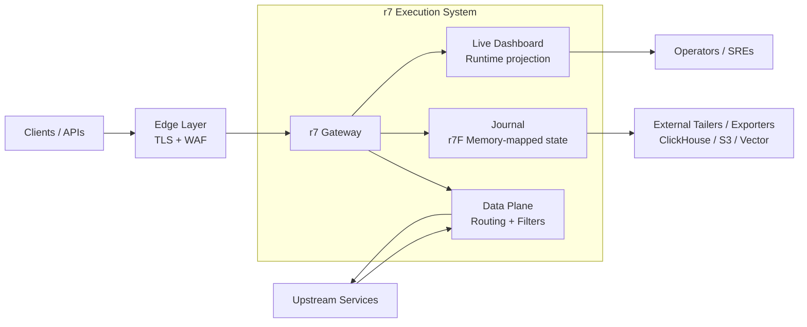

# r7 Gateway


A high-performance JVM gateway for routing, filtering, and observability with minimal runtime overhead.

r7 sits between services and traffic sources, providing a stable and predictable execution layer for HTTP request handling, routing, and auditing.



---

## Designed for predictable systems

r7 is built for environments where performance consistency matters more than peak benchmarks:

- Stable low-latency request processing under load
- Predictable behavior under memory constraints
- Minimal garbage collection pressure in the hot path
- Full request visibility without blocking execution

---

## Core capabilities

- Composable routing engine (predicates + filters)
- High-throughput HTTP entrypoint (Undertow-based)
- Memory-mapped journaling for full request/response auditing
- Real-time operational dashboard
- Plugin system via JVM ServiceLoader (SPI)

---

## Execution model & runtime guarantees

r7 uses a deterministic, streaming execution model for HTTP request processing.

Requests are handled synchronously in a single logical flow, without reactive pipelines or coroutine-based scheduling.

Payloads are processed as streams and are not buffered or modified within the gateway. This ensures strict memory control and predictable runtime behavior under load.

This design leads to:

- Deterministic request lifecycle from ingress to response
- No hidden buffering or allocation spikes in the hot path
- Stable tail latency under memory-constrained environments
- Reduced complexity in failure analysis and debugging

See [Benchmarks](benchmarks.md) for measured results under controlled memory and load conditions.

---

## Live Dashboard

r7 includes a built-in dashboard for live system introspection:

- Route-level inspection
- Request and response journaling
- Error-level filtering and escalation
- Real-time traffic visibility


---

## Declarative configuration model

r7 is fully configured using a simple, self-documenting YAML model.

Routes, predicates, filters, and journaling behavior are defined declaratively and evaluated consistently at runtime without hidden conventions or external orchestration systems.

This allows:

- Fast onboarding without framework-specific knowledge
- Explicit routing behavior that is easy to reason about
- Configuration that can be reviewed, versioned, and audited like code
- No runtime DSLs or embedded scripting required

---

## Example configuration

```yaml
routes:
  - id: static-content
    match:
      - Method:
          include: [GET, POST]
    upstream:
      targets:
        - url: http://localhost:1111
    filters:
      - CorrelationIdHeader
      - RateLimiter:
          capacity: 50000
          refill_period: PT1s
    journal:
      request:
        level: HEADERS
      response:
        level: FULL
```


---

## Architecture overview

r7 separates execution into two planes:

### Data plane

Handles request routing and filtering in a low-allocation hot path executed per request.

### Internal observability

Derived from request execution state, r7 maintains an asynchronous journal and live runtime projection without impacting request latency.

### Journal durability model

The r7 journal is crash-consistent at segment level.

Under abrupt termination (e.g. SIGKILL), partial entries at the tail may be discarded during recovery. Only fully validated entries are retained during journal replay.

---

## Extensibility

Custom behavior can be added via JVM ServiceLoader (SPI):

* Authentication and JWT validation
* Rate limiting strategies
* Request enrichment

See [Extensibility](extensibility.md) page for documentation.

Note: Audit and telemetry pipelines operate on the journal stream via external tailers and are not part of the request execution runtime.

---

## Performance characteristics

r7 is designed for stable behavior under constrained environments, where traditional gateways begin to exhibit tail latency degradation due to memory pressure.

---

## Technical profile

* Platform: Java 25+
* Server: Undertow (XNIO)
* Design: JVM-native, high-throughput gateway architecture

