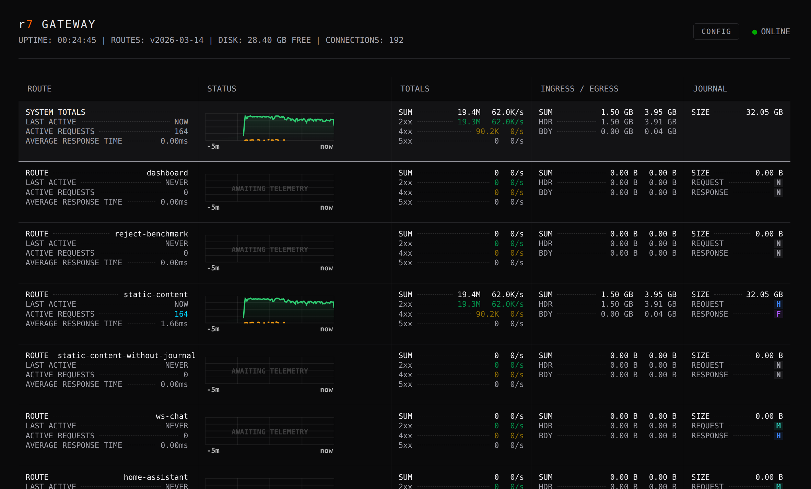
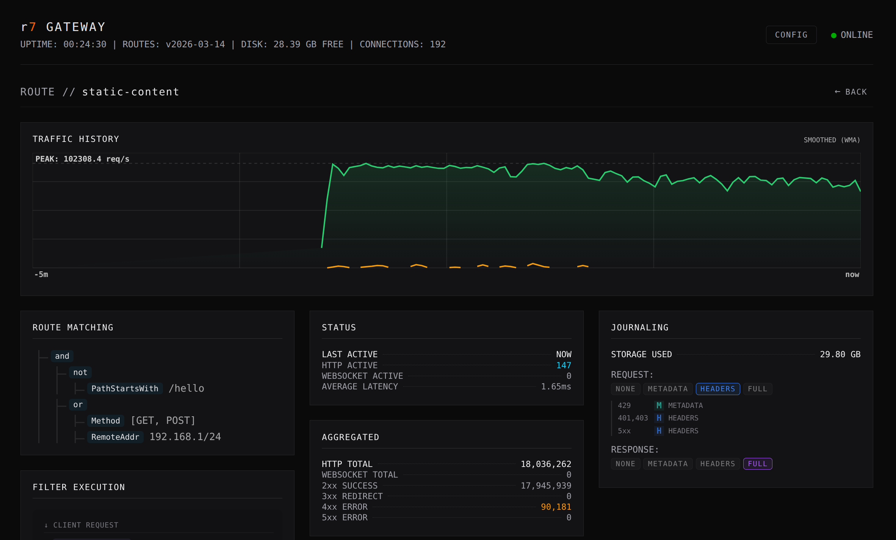

# r7 Gateway

**A focused, high-performance JVM gateway built for predictable throughput and low-impact visibility.**

r7 is designed for stacks where throughput, observability, and control matter. It provides a clean separation between stable APIs, a composable routing engine, high-throughput memory-mapped journaling, and an Undertow-based HTTP entrypoint. The system is intentionally narrow in scope: evaluate requests, apply predicates and filters, route efficiently, and optionally audit.


---

## Predictable Performance and Observability

The r7 gateway is designed around a core engineering philosophy: network infrastructure must provide deep, real-time observability without degrading the performance of the critical path. It achieves this by aligning its metrics architecture with the mechanical realities of the JVM and modern CPU caches, providing operators with high-density telemetry that costs virtually nothing to capture.

### The Low-Allocation Hot Path

High-throughput Java applications frequently suffer from Garbage Collection pauses caused by continuous object churn. r7 drastically reduces this overhead in its core routing and monitoring layers. By initializing all tracking primitives at startup and ruthlessly minimizing per-request object creation, the gateway guarantees a rigorously GC-optimized hot path. Tracking request counts, payload byte totals, and latency incurs almost zero heap pressure during runtime, allowing the system to maintain stable, predictable latency percentiles even under sustained heavy load.

### Wait-Free Concurrency

Traditional atomic counters introduce severe CPU cache-line contention when thousands of worker threads attempt simultaneous updates. The r7 metrics engine avoids this by utilizing striped counting structures and relaxed memory barriers, such as lazy-set operations for timestamps. This creates a strictly asymmetric architecture: write operations on the hot path are completely wait-free and lock-free, while read operations are deferred to a cold path polled only when the dashboard is active. Capturing traffic data never blocks request processing.

---

## Operational Simplicity and Instant Feedback

r7 pairs a declarative configuration model with immediate operational visibility. Routes, predicates, and filter chains are defined in clean YAML, allowing operators to easily compose upstream targets and inject arguments into filters such as `StripPathPrefix` or `AddResponseHeader`.

This simplicity extends to the forensic visibility plane, where journaling policies can be tuned independently per route and per request/response direction. The configuration natively supports the dynamic elevation of audit levels, such as automatically escalating a payload capture from `METADATA` to `HEADERS` when an upstream returns a 5xx error.



**Example Configuration:**

```yaml
routes:
  - id: static-content
    match:
      - not:
          - PathStartsWith:
              prefix: /hello
      - or:
          - Method:
              include:
                - GET
                - POST
          - RemoteAddr:
              source: 192.168.1/24
    upstream:
      targets:
        - url: http://localhost:1111
    filters:
      - RequireAuthorizationHeader
      - RateLimiter:
          capacity: 50000
          refill_tokens: 100000
          refill_period: PT1s
      - CircuitBreaker:
          failure_threshold: 10
          cooldown_period: PT15s
      - CorrelationIdHeader
    journal:
      request:
        level: HEADERS
        status_overrides:
          401,403: HEADERS
          429: METADATA
          5xx: HEADERS
      response:
        level: FULL
```

In production, the companion real-time dashboard translates this static configuration into a live operational instrument. Engineers can instantly inspect active route parameters, monitor the exact I/O cost of their configured journaling policies, and detect upstream degradation through tactical, color-coded error highlighting. This design ensures a tight, frictionless feedback loop between defining a route and observing its real-world behavior.

---

## Composability and Extensibility

Routing in r7 is built from small, testable building blocks: `GatewayPredicate` and `GatewayFilter`. Predicates act as simple boolean tests against a request, while filters can mutate or enrich request attributes.

r7 stays on the JVM intentionally. Predicates and filters can be provided via Java’s `ServiceLoader` (SPI), allowing custom plugins to be added without modifying the core system. This enables rapid enterprise extensions for:

* JWT validation and JWK rotation strategies
* Rate limiting and custom authentication mechanisms
* Request enrichment and specialized audit adapters

---

## Decoupled Visibility: The r7F Journal

Most gateways force a trade-off between visibility and performance. r7’s audit module takes a radically different approach by strictly separating the fast data plane from the visibility plane. It utilizes the **r7 Log Format (r7F)**, a binary write-ahead log designed for zero-copy, high-throughput logging.

* **Zero-Copy Hot Path:** Requests and responses are written to a memory-mapped journal using append-only, mechanically simple operations. There is no per-request serialization penalty or blocking I/O during request handling.
* **Structured Payload Isolation:** Each entry isolates structured metadata (encoded via FlatBuffer `JournalEvent` tables) from variable raw payloads. This allows for efficient sequential logging and partial reads without full deserialization. Byte arrays bypass UTF-8 validation overhead on the hot path.
* **Integrity and Recovery:** Every file utilizes a 1024-byte preamble with a deterministic sequence ID, and every individual journal entry is secured by a CRC32C checksum.
* **Asynchronous Tailers:** A separate tailer process owns the lifecycle of the journal segments. It is responsible for converting the binary entries into JSON, MsgPack, or plain text, and routing the output to external sinks like Vector, ClickHouse, or S3-compatible storage.

The result is full forensic audit capability and high-frequency metrics collection with minimal impact on request latency.

---

## Technical Profile

* **Core API:** Implementation and technology-agnostic interface for predicates and filters.
* **Platform:** Java 25
* **Reference Server:** Undertow (XNIO)
* **Target Environment:** Designed for JVM-native deployment in high-throughput environments requiring full audit visibility and tight integration with existing Java systems.
