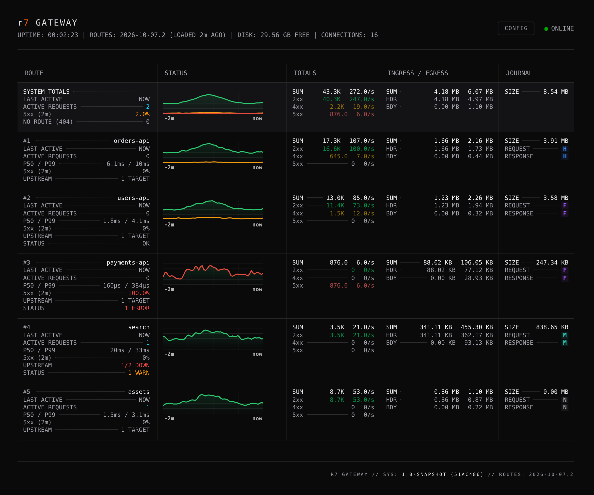
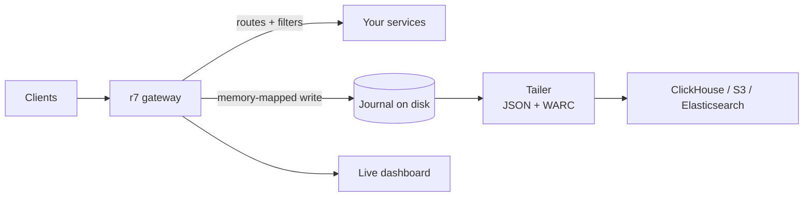

---
hide:
  - navigation
---

# r7: the gateway that remembers every request { .r7-hero }

Put r7 in front of your services and write down where traffic should go. It routes the requests,
checks your configuration before it ever runs, and keeps a record of what passed through, so when
someone asks "what did that client actually send us?", you have the answer.

It is fast out of the box, with high throughput and a short tail and nothing to tune first. One
YAML file to start. No plugins to assemble, no scripting language to learn.

[Get started in five minutes](quickstart.md){ .md-button .md-button--primary }
[Try the config editor](editor.md){ .md-button }

---

## Your first gateway

All r7 needs is a `routes.yaml`:

```yaml title="routes.yaml"
routes:
  - id: api
    match:
      - PathPrefix:
          prefix: /api
    upstream:
      targets:
        - url: http://host.docker.internal:3000
    journal:
      request:
        level: HEADERS
      response:
        level: HEADERS
```

Start it:

```bash
docker run --rm -p 8888:8888 -p 127.0.0.1:18888:18888 \
  --add-host=host.docker.internal:host-gateway \
  -v "$PWD/routes.yaml:/app/config/routes.yaml:ro" \
  -v r7-journals:/journals \
  ghcr.io/ethlo/r7-gateway:main
```

Requests to `http://localhost:8888/api/...` now reach your service on port 3000, and every one of
them is written with its headers to the journal, kept in the `r7-journals` volume. Open `http://localhost:18888` to see your routes,
their upstream health, live response times and any filter that needs attention, such as an open circuit breaker.

That is the whole setup. When you need to tune ports, limits or journal storage, add a
`server.yaml`; until then the defaults are chosen to be safe.



---

## Three things r7 does well

### It remembers every request

Every request and response can be recorded to a journal on local disk: just the essentials
(method, path, status, timing), the headers too, or the full bodies. You choose per route, and you
can turn the detail up only when something goes wrong:

```yaml
journal:
  response:
    level: METADATA
    status_overrides:
      5xx: HEADERS   # keep the headers whenever the upstream fails
```

Journaling never sits in the way of a request: entries are written to memory-mapped files, not
sent over the network while the client waits. A separate tailer ships them on to where you want them,
such as a JSON pipeline for ClickHouse or Elasticsearch, a standard WARC archive, or both. Secrets stay
out by default: header values that are not on an allow-list are stored as fingerprints, not as
plain text.

[How journaling works](journaling.md)

### Your configuration is checked before it runs

A typo in a gateway config usually shows up as a silent misroute in production. r7 refuses to
start instead, and tells you exactly what is wrong:

```text
Unknown filter: 'AddResponseHeadr'. Did you mean 'AddResponseHeader'? Available filters are: …
```

Unknown keys, invalid regular expressions, duplicate route ids, fallback loops and missing
environment variables are all caught at startup. A misspelled option or broken YAML is reported
with its line and column. Edit
`routes.yaml` while r7 runs and it reloads on its own; an edit that does not validate is rejected,
and the routes you had keep serving traffic.

The [online config editor](editor.md) checks your routes against the full schema as you type,
with autocomplete for every filter and predicate.

### Routing you can read top to bottom

Routes are tried in the order you wrote them, and the first one that matches wins. There are no
priority rules to memorise and no hidden precedence between prefix and regex matches. Each filter
does one job and runs in the order it is listed.

r7 also refuses requests that could be read one way by the gateway and another by your service,
such as `/public/../admin` or an encoded slash, so a route that protects a path really does
protect it.

[Configuration reference](config.md)

---

## Is r7 for you?

r7 is a good fit if you want:

- an audit trail of the HTTP traffic in front of your services, without bolting on a separate system
- a gateway whose behaviour you can understand from its config file alone
- strict, early feedback on configuration mistakes, before they reach traffic
- a small, focused tool you can run as a single container or a sidecar

r7 is deliberately not a programmable platform. There is no embedded scripting language; if you
need custom behaviour, you write a filter in Java and register it as a [plugin](extensibility.md).

r7 is pre-release. Configuration and APIs may still change before 1.0.

---

## Under the hood

For those who want to know how it works. r7 is built for high throughput and a low, steady tail
together; none of the choices below trades one for the other.


```mermaid
graph LR
    Client[Clients] --> R7[r7 gateway]
    R7 -->|routes + filters| Up[Your services]
    R7 -->|memory-mapped write| Journal[(Journal on disk)]
    Journal --> Tailers[Tailer<br/>JSON + WARC]
    Tailers --> Store[ClickHouse / S3 / Elasticsearch]
    R7 --> Dash[Live dashboard]
```

- **Runtime:** Java 25+, on Helidon Níma with one virtual thread per connection. Each request is
  handled in a single synchronous flow, with no reactive pipelines.
- **Streaming:** request and response bodies are streamed through, not buffered or modified, which
  keeps memory use predictable under load.
- **Journal:** an append-only binary format (r7f) in memory-mapped segments. It is crash-consistent
  at segment level: after an abrupt kill, a partially written entry at the tail is discarded on
  recovery and every complete entry is kept.
- **Hot path:** routing and filtering are written to keep allocation per request low; a test in the
  build holds it to a budget.
- **Extensibility:** filters and predicates are discovered through the JVM `ServiceLoader`.

[Benchmarks](benchmarks.md) · [Performance tuning](performance_tuning.md) · [Licensing](licensing.md)
