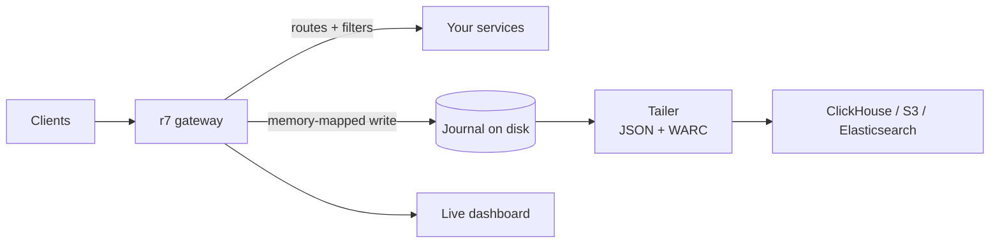

---
hide:
  - navigation
---

# r7: the gateway that remembers every request { .r7-hero }

When someone asks what a client actually sent you, r7 has the answer. It routes traffic to your
services and records every exchange, with its headers or its full bodies, to local disk, with
secrets stored as fingerprints. A tailer ships the record as WARC and JSON lines into the tools
you already run. There is no capture system to run beside the gateway, and no network call while
the client waits.

One `routes.yaml`, checked before it serves a single request.

[Get started in five minutes](quickstart.md){ .md-button .md-button--primary }
[Try the config editor](editor.md){ .md-button }

---

## Your first gateway

All r7 needs is a `routes.yaml`:

```yaml title="routes.yaml"
routes:
  - id: api
    match:
      - PathPrefix:
          prefix: /api
    upstream:
      targets:
        - url: http://host.docker.internal:3000
    journal:
      request:
        level: HEADERS
      response:
        level: HEADERS
```

Start it:

```bash
(umask 077; set -C; echo "R7_FINGERPRINT_KEY=$(openssl rand -base64 32)" > .env)   # once: keep it, and keep it private
docker run --rm -p 8888:8888 -p 127.0.0.1:18888:18888 \
  --add-host=host.docker.internal:host-gateway \
  --env-file .env \
  -v "$PWD/routes.yaml:/app/config/routes.yaml:ro" \
  -v r7-journals:/journals \
  ghcr.io/ethlo/r7-gateway:main
```

Requests to `http://localhost:8888/api/...` now reach your service on port 3000, and every one of
them is written with its headers to the journal, kept in the `r7-journals` volume. Open `http://localhost:18888` to see your routes,
their upstream health, live response times and any filter that needs attention, such as an open circuit breaker.

That is the whole setup. When you need to tune ports, limits or journal storage, add a
`server.yaml`; until then the defaults are chosen to be safe.


---

## What r7 does that other gateways leave to you

### Every request, on the record

Most gateways log a line per request: method, path, status, timing. When a client disputes what
it sent, or an incident review needs the actual payload, that line is not enough, and getting
more means a mirror, a tap or a script you maintain. r7 records the exchange itself: just the
essentials, the headers too, or the full bodies. You choose per route, and the detail goes up on
its own when something fails:

```yaml
journal:
  response:
    level: METADATA
    status_overrides:
      5xx: HEADERS   # keep the headers whenever the upstream fails
```

Entries are written to memory-mapped files on local disk; nothing goes over the network while
the client waits. A separate tailer turns them into standard formats: JSON lines that the
OpenTelemetry Collector, Vector, Fluent Bit or Promtail read as they are, and WARC, the archive
format pywb and other replay tools read. Secrets stay out by default: a header value that is not
on an allow-list is stored as a keyed fingerprint, so you can see that two requests carried the
same token without anyone reading the token.

[How journaling works](journaling.md) · [Where r7 fits in your stack](where-r7-fits.md)

### A config that is checked before it serves

A typo in a gateway config usually shows up as a silent misroute in production. r7 refuses to
start instead, and tells you exactly what is wrong:

```text
Unknown filter: 'AddResponseHeadr'. Did you mean 'AddResponseHeader'? Available filters are: …
```

Unknown keys, invalid regular expressions, duplicate route ids, fallback loops and missing
environment variables are all caught at startup. A misspelled option or broken YAML is reported
with its line and column. Edit `routes.yaml` while r7 runs and it reloads on its own; an edit
that does not validate is rejected, and the routes you had keep serving traffic.

The [online config editor](editor.md) checks your routes against the full schema as you type,
with autocomplete for every filter and predicate.

### Routing you can read top to bottom

Gateways with priority rules make you work out which route wins. In r7, routes are tried in the
order you wrote them, and the first one that matches wins. There is no hidden precedence between
prefix and regex matches. Each filter does one job and runs in the order it is listed.

r7 also refuses requests that the gateway and your service would read differently, such as
`/public/../admin` or an encoded slash, so a route that protects a path really does protect it.

[Configuration reference](config.md)

### Extensions in plain Java

When the built-in filters are not enough, you write a filter as a Java class and drop the jar
on the classpath. Each stage of a request has its own interface, and each hands the filter only
what it may change at that point:

| Stage | Can read | Can change |
| --- | --- | --- |
| Client request | the request as the client sent it | nothing on the request; it can answer the client itself or cap the body size |
| Upstream request | the client's request | the request r7 sends upstream: path, query, headers, cookies, method |
| Client response | the client's request, the upstream request and response | the status and headers the client gets |
| Completed | the whole exchange | nothing that was sent |

The compiler enforces this: no filter can change the request as the client sent it, so the
journal's record of it is what arrived. A filter's settings are a Java record that validates
itself, so a mistake in a plugin's YAML is reported at startup like one in a built-in filter.

Every request runs start to finish on one virtual thread, the upstream call included. There is
no reactive chain, no callbacks and no handoff to a worker pool, so a filter is straight-line
code: it can call a database or another service directly, and a stack trace points at the line
that failed.

[Write a filter or predicate](extensibility.md)

---

## Choose r7 when

- You have to show what was sent and returned: disputes with API clients, audits, incident
  reviews, record-keeping rules.
- You want that record from the gateway itself, not from a mirror, a tap or a script you
  maintain.
- Your team should be able to tell what the gateway does from one file, read top to bottom.
- You extend the gateway in Java and want plain, blocking code instead of a reactive API.

## Use something else when

- **You want TLS and certificates handled by the gateway.** r7 does not terminate TLS. Put
  Caddy, nginx or your cloud load balancer in front; r7 runs behind it.
- **You want to script the gateway, or pick from a plugin marketplace.** Envoy, Kong and nginx
  with Lua do that. r7 has no embedded scripting language; custom behaviour is a Java filter.
- **You need HTTP/3, or mTLS towards your upstreams.** r7 speaks HTTP/1.1 to upstreams and has
  no client certificates. The full list is in
  [Known limitations](https://github.com/ethlo/r7/blob/main/design/limitations.md).

---

## Under the hood

r7 is built for high throughput and a low, steady tail together; none of the choices below
trades one for the other.


```mermaid
graph LR
    Client[Clients] --> R7[r7 gateway]
    R7 -->|routes + filters| Up[Your services]
    R7 -->|memory-mapped write| Journal[(Journal on disk)]
    Journal --> Tailers[Tailer<br/>JSON + WARC]
    Tailers --> Store[ClickHouse / S3 / Elasticsearch]
    R7 --> Dash[Live dashboard]
```

- **Runtime:** Java 25+, on Helidon Níma with one virtual thread per connection. Each request,
  the upstream call included, runs on that thread in a single synchronous flow: nothing crosses
  threads, and there are no reactive pipelines or worker pools in the request path.
- **Streaming:** request and response bodies are streamed through, not buffered or modified, which
  keeps memory use predictable under load.
- **Journal:** an append-only binary format (r7f) in memory-mapped segments. It is crash-consistent
  at segment level: after an abrupt kill, a partially written entry at the tail is discarded on
  recovery and every complete entry is kept. Writing it costs CPU at full load, mostly for
  compression; [Performance tuning](performance_tuning.md) has the measurements.
- **Hot path:** routing and filtering are written to keep allocation per request low; a test in the
  build holds it to a budget.
- **Extensibility:** filters and predicates are discovered through the JVM `ServiceLoader`.

[Performance tuning](performance_tuning.md) · [Licensing](licensing.md)
