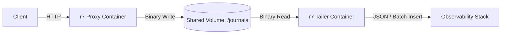

# Journal Tailing and Observability

ethlo r7 is designed for absolute minimum latency. Instead of serializing logs to text or establishing network connections to logging databases on the request thread, r7 writes raw traffic data directly to memory-mapped binary files (journals) on disk.

To ingest these logs into your observability stack (like Grafana, ELK, or ClickHouse), r7 uses **Tailers**. Tailers run as separate processes or sidecar containers, reading the binary journals asynchronously without impacting the proxy's performance.

## The Sidecar Deployment Pattern

In containerized environments, the proxy and the tailer share a volume. The proxy writes the binary journals, and the tailer reads them.



---

## Tailer Implementations

We provide pre-built Docker images for the most common observability architectures.

### 1. Standard JSON Tailer (Universal)

!!! important
     Not yet ready!

**Image:** `ghcr.io/ethlo/r7-tailer-json:latest`

This tailer converts the binary journal entries into verbose JSON and streams them to standard output (`stdout`). This is the recommended approach if you use generic log forwarders like **Promtail (for Grafana Loki)**, **Fluent Bit**, or **Vector**.

**Example Docker Compose Integration:**

```yaml
services:
  r7-api:
    image: ghcr.io/ethlo/r7-jvm:latest
    volumes:
      - ./config:/app/config:ro
      - r7-journals:/journals:rw # Mount the shared volume

  r7-tailer-json:
    image: ghcr.io/ethlo/r7-tailer-json:latest
    volumes:
      - r7-journals:/journals:ro # Mount read-only
    environment:
      - JOURNAL_DIR=/journals
    # The output of this container goes to Docker's stdout, 
    # ready to be scraped by your infrastructure's logging driver.

volumes:
  r7-journals:

```

### 2. ClickHouse Tailer

!!! important
    Not yet ready!

**Image:** `ghcr.io/ethlo/r7-tailer-clickhouse:latest`

For extremely high-throughput environments, storing access logs in a standard inverted-index database (like Elasticsearch) becomes prohibitively expensive. ClickHouse is a columnar database uniquely suited for this scale.

This tailer reads the binary journals and performs optimized, asynchronous batch inserts directly into ClickHouse using the `JSONEachRow` format.

**Example Docker Compose Integration:**

```yaml
services:
  r7-api:
    image: ghcr.io/ethlo/r7-jvm:latest
    volumes:
      - r7-journals:/journals:rw

  r7-tailer-clickhouse:
    image: ghcr.io/ethlo/r7-tailer-clickhouse:latest
    volumes:
      - r7-journals:/journals:ro
    environment:
      - JOURNAL_DIR=/journals
      - CLICKHOUSE_URL=jdbc:clickhouse://clickhouse-server:8123/r7_logs
      - CLICKHOUSE_USER=default
      - CLICKHOUSE_PASSWORD=secret
      - BATCH_SIZE=10000
      - FLUSH_INTERVAL_MS=1000

volumes:
  r7-journals:

```

## Visualizing in Grafana

Once your data is routed through a tailer:

* **If using the JSON Tailer with Promtail/Loki:** You can use Grafana's LogQL to filter and aggregate your proxy traffic, extracting metrics dynamically from the JSON fields (like `duration`, `status`, or specific headers).
* **If using the ClickHouse Tailer:** Install the official ClickHouse plugin for Grafana. You can write standard SQL queries against the `r7_logs` table to build blazing-fast dashboards for latency percentiles, error rates, and traffic volume.