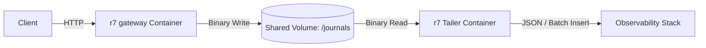

# Journal Tailing and Observability

ethlo r7 is designed for absolute minimum latency. Instead of serializing logs to text or establishing network connections to logging databases on the request thread, r7 writes raw traffic data directly to memory-mapped binary files (journals) on disk.

To ingest these logs into your observability stack (like Grafana, ELK, or ClickHouse), r7 uses **Tailers**. Tailers run as separate processes or sidecar containers, reading the binary journals asynchronously without impacting the gateway's performance.

## The Sidecar Deployment Pattern

In containerized environments, the gateway and the tailer share a volume. The gateway writes the binary journals, and the tailer reads them.

!!! warning "The journal mount must be read-write on the tailer side too"
    A tailer does more than read: it deletes segments once they are fully processed (or once
    `TTL` expires, see below) and persists a `.r7_checkpoints` file — by default under a
    dedicated subdirectory of the journal directory, see `CHECKPOINT_DIR` below — so it can
    resume where it left off after a restart. Mounting `/journals` read-only on the tailer will
    not fail loudly — it fails as segments silently piling up and the checkpoint file never
    being written.

!!! note "Running more than one tailer against the same journal directory"
    Each tailer keeps its own checkpoint under its own `CHECKPOINT_DIR` (a dedicated
    subdirectory by default, e.g. `.r7-tailer-json` / `.r7-tailer-warc`, one per tailer
    implementation), so two different tailers (say, one JSON and one WARC) no longer overwrite
    each other's progress. Deletion is still a shared resource, though: by default a tailer
    deletes a segment as soon as *it* has fully read it, which would delete it out from under a
    second, slower tailer. To run more than one tailer against the same directory, set `TTL` on
    every tailer involved to a value comfortably longer than the slowest tailer's expected
    catch-up time (for example `24h`), and rely on `TTL` rather than per-tailer completion for
    retention — a segment is then kept for at least that long regardless of which tailer has
    read it, and removed once every tailer has had a fair chance to.


```mermaid
graph LR
    Client -->|HTTP| R7[r7 gateway Container]
    R7 -->|Binary Write| Vol[(Shared Volume: /journals)]
    Vol -->|Binary Read| Tailer[r7 Tailer Container]
    Tailer -->|JSON / Batch Insert| Ops[Observability Stack]

```

---

## Tailer Implementations

We provide pre-built Docker images for the most common observability architectures.

### 1. Standard JSON Tailer (Universal)

**Image:** `ghcr.io/ethlo/r7-tailer-json:latest`

This tailer converts the binary journal entries into verbose JSON and streams them to standard output (`stdout`) by default. This is the recommended approach if you use generic log forwarders like **Promtail (for Grafana Loki)**, **Fluent Bit**, or **Vector**.

**Configuration (environment variables):**

| Variable          | Default     | Meaning                                                                 |
|-------------------|-------------|--------------------------------------------------------------------------|
| `JOURNAL_DIR`     | `/journals` | Directory the tailer reads binary journals from                          |
| `CHECKPOINT_DIR`  | `<JOURNAL_DIR>/.r7-tailer-json` | Directory `.r7_checkpoints` is read from and written to; give each tailer its own to run more than one against the same `JOURNAL_DIR` |
| `OUTPUT_PATH`     | `-`         | Where JSON lines are written; `-` (or `stdout`) means standard output, any other value is a file path (appended to, parent directories created if missing) |
| `MIN_AGE`         | `1h`        | How old a segment must be, after this tailer has fully read it, before it is eligible for deletion. Supports `ms`, `s`, `m`, `h`, `d` |
| `TTL`             | disabled    | Hard retention ceiling: a segment older than this is deleted whether or not it was fully read, which is what lets more than one tailer follow the same journal directory (see the note above). Same units as `MIN_AGE` |
| `POLL_INTERVAL`   | `1s`        | Delay between tailer ticks. Same units as `MIN_AGE`                      |
| `PRETTY_PRINT`    | `false`     | Pretty-print the JSON output                                              |

**Example Docker Compose Integration:**

```yaml
services:
  r7-api:
    image: ghcr.io/ethlo/r7-gateway:latest
    volumes:
      - ./config:/app/config:ro
      - r7-journals:/journals:rw # Mount the shared volume

  r7-tailer-json:
    image: ghcr.io/ethlo/r7-tailer-json:latest
    volumes:
      - r7-journals:/journals:rw # r7Tailer deletes completed segments and writes its checkpoint file here
    environment:
      - JOURNAL_DIR=/journals
    # The output of this container goes to Docker's stdout, 
    # ready to be scraped by your infrastructure's logging driver.

volumes:
  r7-journals:

```

### 2. WARC/zstd Tailer (Archival)

**Image:** `ghcr.io/ethlo/r7-tailer-warc:latest`

This tailer writes completed exchanges as [WARC 1.1](https://iipc.github.io/warc-specifications/specifications/warc-format/warc-1.1/) records — the standard web-archiving format used by the Internet Archive and national libraries — to rotating `.warc.zst` files. Use this when you need a durable, replayable, tool-interoperable record of actual request/response traffic (compliance archiving, incident forensics, replaying real traffic against a new backend), rather than a queryable log stream.

Each WARC record is compressed as one independent Zstandard frame per the (proposed) IIPC "Zstandard Compression for WARC Files" convention — the same "record-at-a-time" approach `.warc.gz` has used for gzip since WARC/1.0. `zstd -d` (or any zstd-aware WARC tool) decompresses the whole file back to a plain WARC stream.

**Record shape.** Every exchange is written as up to four records, in the order they occurred: the client request, the forwarded upstream request, the upstream response, and the client response — linked to each other by repeated `WARC-Concurrent-To` fields (see [`design/warc.md`](https://github.com/ethlo/r7/blob/main/design/warc.md) for the full rationale). The gateway's journal stores exactly one copy of a request body and one copy of a response body per exchange — not one per network leg — so the upstream request/response records never have a payload of their own to write: each carries `WARC-Truncated: unspecified` plus the `WARC-Payload-Digest` of the payload the corresponding client-side record actually stores. This is deliberately not a `revisit` record — `revisit` means "unchanged since it was previously archived", which the second hop of one exchange is not. A request/response record with a body that was never captured at all — the journal level for that route/direction is below `FULL`, even though traffic was non-zero — is likewise marked `WARC-Truncated: unspecified`, so it cannot be mistaken for a message that genuinely had no body. Every record also carries a per-file, monotonically increasing `WARC-X-R7-Sequence`, so a reader can tell a shorter-than-expected file apart from one that finished cleanly. All records of one exchange are written to disk as a single batch, but the underlying write is not guaranteed atomic (a full disk can fail partway through). If it fails, the writer never seals the file it was writing to — it deletes the whole `.open` file, including any earlier, successfully written groups, and opens a fresh one for the retried exchange, so a sealed `.warc.zst` file is never left with a truncated trailing frame. `R7Tailer` re-delivers the failed exchange on its next tick, and the tailer process itself survives the failure to retry it.

**Cross-exchange deduplication.** Separately, two genuinely different exchanges (a repeated static asset, a cached response) can produce byte-identical payloads. The client request/response records participate in this via a bounded, digest-keyed cache of payloads already written in full: the first record needing a given payload (by SHA-256) is written normally, and a later record for a *different* exchange needing the same payload is written as a `revisit` record per the WARC 1.1 `identical-payload-digest` profile — headers preserved, payload omitted, `WARC-Truncated: length`, and a `WARC-Refers-To`/`-Target-URI`/`-Date` pointing back at the original record. The cache is only ever consulted or updated after a whole exchange's own records have been decided, so a request and response that happen to share a payload (e.g. both empty) within the *same* exchange are never revisited against each other.

**Checksum integrity.** If the journal itself reports a body checksum mismatch for a leg (stored bytes don't match what the gateway recorded at request time), that leg's records are written without a payload or digest, marked `WARC-Truncated: unspecified` and `WARC-R7-Checksum-Mismatch: true`, instead of silently archiving corrupted bytes as an authoritative record.

**Configuration (environment variables):**

| Variable                   | Default     | Meaning                                                                    |
|----------------------------|-------------|-----------------------------------------------------------------------------|
| `JOURNAL_DIR`               | `/journals` | Directory the tailer reads binary journals from                             |
| `CHECKPOINT_DIR`            | `<JOURNAL_DIR>/.r7-tailer-warc` | Directory `.r7_checkpoints` is read from and written to; give each tailer its own to run more than one against the same `JOURNAL_DIR` |
| `OUTPUT_DIR`                | `/warc`     | Directory rotated `.warc.zst` files are written to                          |
| `WARC_FILE_PREFIX`          | `r7`        | Filename prefix for rotated WARC files                                      |
| `WARC_MAX_FILE_SIZE`        | `1gb`       | Rotate to a new file once the current one reaches this size (at least `64kb`; a size that couldn't hold a single record is refused at startup). Supports `b`, `kb`, `mb`, `gb` |
| `WARC_MAX_FILE_AGE`         | `15m`       | Rotate to a new file once the current one is this old, even under light/no traffic (size-or-age rollover). Supports `ms`, `s`, `m`, `h`, `d` |
| `ZSTD_LEVEL`                | `9`         | Zstandard compression level (1-22), applied per WARC record                 |
| `DEDUP_CACHE_ENTRIES`       | `100000`    | Max number of payload digests remembered for cross-exchange revisit dedup   |
| `MIN_AGE`                   | `1h`        | How old a segment must be, after this tailer has fully read it, before it is eligible for deletion. Same units as `WARC_MAX_FILE_AGE` |
| `TTL`                       | disabled    | Hard retention ceiling: a segment older than this is deleted whether or not it was fully read, which is what lets more than one tailer follow the same journal directory (see the note above). Same units as `WARC_MAX_FILE_AGE` |
| `POLL_INTERVAL`             | `1s`        | Delay between tailer ticks. Same units as `WARC_MAX_FILE_AGE`               |

**Example Docker Compose Integration:**

```yaml
services:
  r7-api:
    image: ghcr.io/ethlo/r7-gateway:latest
    volumes:
      - r7-journals:/journals:rw

  r7-tailer-warc:
    image: ghcr.io/ethlo/r7-tailer-warc:latest
    volumes:
      - r7-journals:/journals:rw
      - r7-warc:/warc:rw
    environment:
      - JOURNAL_DIR=/journals
      - OUTPUT_DIR=/warc

volumes:
  r7-journals:
  r7-warc:

```

### 3. ClickHouse Tailer

!!! important
    Not yet ready!

**Image:** `ghcr.io/ethlo/r7-tailer-clickhouse:latest`

For extremely high-throughput environments, storing access logs in a standard inverted-index database (like Elasticsearch) becomes prohibitively expensive. ClickHouse is a columnar database uniquely suited for this scale.

This tailer reads the binary journals and performs optimized, asynchronous batch inserts directly into ClickHouse using the `JSONEachRow` format.

**Example Docker Compose Integration:**

```yaml
services:
  r7-api:
    image: ghcr.io/ethlo/r7-gateway:latest
    volumes:
      - r7-journals:/journals:rw

  r7-tailer-clickhouse:
    image: ghcr.io/ethlo/r7-tailer-clickhouse:latest
    volumes:
      - r7-journals:/journals:rw
    environment:
      - JOURNAL_DIR=/journals
      - CLICKHOUSE_URL=jdbc:clickhouse://clickhouse-server:8123/r7_logs
      - CLICKHOUSE_USER=default
      - CLICKHOUSE_PASSWORD=secret
      - BATCH_SIZE=10000
      - FLUSH_INTERVAL=1s

volumes:
  r7-journals:

```

## Visualizing in Grafana

Once your data is routed through a tailer:

* **If using the JSON Tailer with Promtail/Loki:** You can use Grafana's LogQL to filter and aggregate your gateway traffic, extracting metrics dynamically from the JSON fields (like `duration`, `status`, or specific headers).
* **If using the WARC Tailer:** WARC files are for archival/replay, not dashboards — feed them to a WARC-aware tool (e.g. [pywb](https://github.com/webrecorder/pywb)) to replay captured traffic, or to an indexer for forensic search.
* **If using the ClickHouse Tailer:** Install the official ClickHouse plugin for Grafana. You can write standard SQL queries against the `r7_logs` table to build blazing-fast dashboards for latency percentiles, error rates, and traffic volume.