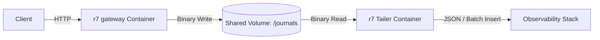

# Journal Tailing and Observability

ethlo r7 is designed for absolute minimum latency. Instead of serializing logs to text or establishing network connections to logging databases on the request thread, r7 writes raw traffic data directly to memory-mapped binary files (journals) on disk.

To ingest these logs into your observability stack (like Grafana, ELK, or ClickHouse), r7 uses **Tailers**. Tailers run as separate processes or sidecar containers, reading the binary journals asynchronously without impacting the gateway's performance.

## The Sidecar Deployment Pattern

In containerized environments, the gateway and the tailer share a volume. The gateway writes the binary journals, and the tailer reads them.


```mermaid
graph LR
    Client -->|HTTP| R7[r7 gateway Container]
    R7 -->|Binary Write| Vol[(Shared Volume: /journals)]
    Vol -->|Binary Read| Tailer[r7 Tailer Container]
    Tailer -->|JSON / Batch Insert| Ops[Observability Stack]

```

---

## Tailer Implementations

We provide pre-built Docker images for the most common observability architectures.

### 1. Standard JSON Tailer (Universal)

**Image:** `ghcr.io/ethlo/r7-tailer-json:latest`

This tailer converts the binary journal entries into verbose JSON and streams them to standard output (`stdout`) by default. This is the recommended approach if you use generic log forwarders like **Promtail (for Grafana Loki)**, **Fluent Bit**, or **Vector**.

**Configuration (environment variables):**

| Variable          | Default     | Meaning                                                                 |
|-------------------|-------------|--------------------------------------------------------------------------|
| `JOURNAL_DIR`     | `/journals` | Directory the tailer reads binary journals from                          |
| `OUTPUT_PATH`     | `-`         | Where JSON lines are written; `-` (or `stdout`) means standard output, any other value is a file path (appended to, parent directories created if missing) |
| `MIN_AGE_SECONDS` | `3600`      | How old a segment must be before it is eligible for tailing/deletion     |
| `POLL_INTERVAL_MS`| `1000`      | Delay between tailer ticks                                                |
| `PRETTY_PRINT`    | `false`     | Pretty-print the JSON output                                              |

**Example Docker Compose Integration:**

```yaml
services:
  r7-api:
    image: ghcr.io/ethlo/r7-gateway:latest
    volumes:
      - ./config:/app/config:ro
      - r7-journals:/journals:rw # Mount the shared volume

  r7-tailer-json:
    image: ghcr.io/ethlo/r7-tailer-json:latest
    volumes:
      - r7-journals:/journals:ro # Mount read-only
    environment:
      - JOURNAL_DIR=/journals
    # The output of this container goes to Docker's stdout, 
    # ready to be scraped by your infrastructure's logging driver.

volumes:
  r7-journals:

```

### 2. WARC/zstd Tailer (Archival)

**Image:** `ghcr.io/ethlo/r7-tailer-warc:latest`

This tailer writes completed exchanges as [WARC 1.1](https://iipc.github.io/warc-specifications/specifications/warc-format/warc-1.1/) records — the standard web-archiving format used by the Internet Archive and national libraries — to rotating `.warc.zst` files. Use this when you need a durable, replayable, tool-interoperable record of actual request/response traffic (compliance archiving, incident forensics, replaying real traffic against a new backend), rather than a queryable log stream.

Each WARC record is compressed as one independent Zstandard frame per the (proposed) IIPC "Zstandard Compression for WARC Files" convention — the same "record-at-a-time" approach `.warc.gz` has used for gzip since WARC/1.0. `zstd -d` (or any zstd-aware WARC tool) decompresses the whole file back to a plain WARC stream.

**Deduplication.** The gateway's journal stores exactly one copy of a request body and one copy of a response body per exchange — not one per network leg — so the client-facing and upstream-facing legs of the same exchange are structurally guaranteed to carry byte-identical payloads. The tailer exploits this with a single mechanism: a bounded, digest-keyed cache of payloads already written in full. The first record needing a given payload (by SHA-256) is written normally; every later record needing the same payload — whether that's the other leg of the very same exchange, or a completely different exchange that happens to return the same bytes (a cached response, a repeated static asset) — is written as a `revisit` record per the WARC 1.1 `identical-payload-digest` profile: headers preserved, payload omitted, `WARC-Truncated: length`, and a `WARC-Refers-To`/`-Target-URI`/`-Date` pointing back at the original record.

**Configuration (environment variables):**

| Variable                   | Default     | Meaning                                                                    |
|----------------------------|-------------|-----------------------------------------------------------------------------|
| `JOURNAL_DIR`               | `/journals` | Directory the tailer reads binary journals from                             |
| `OUTPUT_DIR`                | `/warc`     | Directory rotated `.warc.zst` files are written to                          |
| `WARC_FILE_PREFIX`          | `r7`        | Filename prefix for rotated WARC files                                      |
| `WARC_MAX_FILE_SIZE_BYTES`  | `1000000000`| Rotate to a new file once the current one reaches this size                 |
| `ZSTD_LEVEL`                | `9`         | Zstandard compression level (1-22), applied per WARC record                 |
| `DEDUP_CACHE_ENTRIES`       | `100000`    | Max number of payload digests remembered for revisit-record deduplication   |
| `MIN_AGE_SECONDS`           | `3600`      | How old a segment must be before it is eligible for tailing/deletion        |
| `POLL_INTERVAL_MS`          | `1000`      | Delay between tailer ticks                                                   |

**Example Docker Compose Integration:**

```yaml
services:
  r7-api:
    image: ghcr.io/ethlo/r7-gateway:latest
    volumes:
      - r7-journals:/journals:rw

  r7-tailer-warc:
    image: ghcr.io/ethlo/r7-tailer-warc:latest
    volumes:
      - r7-journals:/journals:ro
      - r7-warc:/warc:rw
    environment:
      - JOURNAL_DIR=/journals
      - OUTPUT_DIR=/warc

volumes:
  r7-journals:
  r7-warc:

```

### 3. ClickHouse Tailer

!!! important
    Not yet ready!

**Image:** `ghcr.io/ethlo/r7-tailer-clickhouse:latest`

For extremely high-throughput environments, storing access logs in a standard inverted-index database (like Elasticsearch) becomes prohibitively expensive. ClickHouse is a columnar database uniquely suited for this scale.

This tailer reads the binary journals and performs optimized, asynchronous batch inserts directly into ClickHouse using the `JSONEachRow` format.

**Example Docker Compose Integration:**

```yaml
services:
  r7-api:
    image: ghcr.io/ethlo/r7-gateway:latest
    volumes:
      - r7-journals:/journals:rw

  r7-tailer-clickhouse:
    image: ghcr.io/ethlo/r7-tailer-clickhouse:latest
    volumes:
      - r7-journals:/journals:ro
    environment:
      - JOURNAL_DIR=/journals
      - CLICKHOUSE_URL=jdbc:clickhouse://clickhouse-server:8123/r7_logs
      - CLICKHOUSE_USER=default
      - CLICKHOUSE_PASSWORD=secret
      - BATCH_SIZE=10000
      - FLUSH_INTERVAL_MS=1000

volumes:
  r7-journals:

```

## Visualizing in Grafana

Once your data is routed through a tailer:

* **If using the JSON Tailer with Promtail/Loki:** You can use Grafana's LogQL to filter and aggregate your gateway traffic, extracting metrics dynamically from the JSON fields (like `duration`, `status`, or specific headers).
* **If using the WARC Tailer:** WARC files are for archival/replay, not dashboards — feed them to a WARC-aware tool (e.g. [pywb](https://github.com/webrecorder/pywb)) to replay captured traffic, or to an indexer for forensic search.
* **If using the ClickHouse Tailer:** Install the official ClickHouse plugin for Grafana. You can write standard SQL queries against the `r7_logs` table to build blazing-fast dashboards for latency percentiles, error rates, and traffic volume.