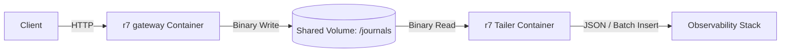

# Journal Tailing and Observability

r7 writes request/response traffic straight to memory-mapped binary files (journals) on disk
instead of serializing logs to text or making network calls on the request thread — that's what
keeps the hot path fast. To get that data into Grafana, ELK, ClickHouse or a WARC archive, you
run a **Tailer**: a separate process/sidecar that reads the journals asynchronously.


```mermaid
graph LR
    Client -->|HTTP| R7[r7 gateway Container]
    R7 -->|Binary Write| Vol[(Shared Volume: /journals)]
    Vol -->|Binary Read| Tailer[r7 Tailer Container]
    Tailer -->|JSON / Batch Insert| Ops[Observability Stack]

```

## 1. Turn on journaling

Tailers only see what the gateway actually writes. Set the level per route (and optionally
override it by response status) in `routes.yaml`:

```yaml
routes:
  - id: my-route
    journal:
      request:
        level: METADATA
      response:
        level: METADATA
        status_overrides:
          5xx: FULL   # capture bodies when things break
```

`NONE` / `METADATA` / `HEADERS` / `FULL` — see [Configuration §7](config.md#7-journaling-storage)
for the full table and the `storage` block (`work_dir`, `shard_size`, `shard_count`) that
controls where and how those journals are written on disk.

## 2. Pick a sidecar and mount the shared volume

Gateway and tailer share the `journal_dir` volume: the gateway writes, the tailer only reads.

!!! warning "Mount `journal_dir` read-only on every tailer"
    `R7Tailer` never deletes a segment — it only reads. Deciding when a fully-read segment is
    safe to remove is a separate reaper process you run yourself; it's the only thing that
    needs write access to `journal_dir`. Give each tailer its own `checkpoint_dir` (see the
    tables below) so running JSON and WARC tailers side by side doesn't clash — neither can
    delete a segment out from under the other, and a reaper just waits until every tailer has
    had a fair chance at a segment before removing it.

---

## 3. Tailer images

### JSON Tailer (Universal)

**Image:** `ghcr.io/ethlo/r7-tailer-json:latest`

This tailer converts the binary journal entries into verbose JSON and streams them to standard output (`stdout`) by default. This is the recommended approach if you use generic log forwarders like **Promtail (for Grafana Loki)**, **Fluent Bit**, or **Vector**.

**Configuration:** like the gateway, this tailer reads a YAML file — `config/jsonld-tailer.yaml`
by default, overridable via the `JSONLD_TAILER_CONFIG` env var — with the same `${VAR:default}`
interpolation support as `routes.yaml`/`server.yaml`. If the file is missing, all fields fall back
to their defaults below (so a bare container with no config volume still starts and tails
`/journals` to stdout).

| Field           | Default     | Meaning                                                                 |
|------------------|-------------|--------------------------------------------------------------------------|
| `journal_dir`     | `/journals` | Directory the tailer reads binary journals from                          |
| `checkpoint_dir`  | `/checkpoints` | Directory `.r7_checkpoints` is read from and written to; a dedicated volume, outside `journal_dir`, so `journal_dir` can be mounted `:ro` on a secondary tailer. Give each tailer its own to run more than one against the same `journal_dir` |
| `output_path`     | `-`         | Where JSON lines are written; `-` (or `stdout`) means standard output, any other value is a file path (appended to, parent directories created if missing) |
| `poll_interval`   | `1s`        | Delay between tailer ticks. Supports `ms`, `s`, `m`, `h`, `d`             |
| `pretty_print`    | `false`     | Pretty-print the JSON output                                              |

**Example `config/jsonld-tailer.yaml`:**

```yaml
journal_dir: /journals
checkpoint_dir: /checkpoints
output_path: "-"
```

**Example Docker Compose Integration:**

```yaml
services:
  r7-api:
    image: ghcr.io/ethlo/r7-gateway:latest
    volumes:
      - ./config:/app/config:ro
      - r7-journals:/journals:rw # Mount the shared volume

  r7-tailer-json:
    image: ghcr.io/ethlo/r7-tailer-json:latest
    volumes:
      - ./config/jsonld-tailer.yaml:/app/config/jsonld-tailer.yaml:ro
      - r7-journals:/journals:ro # this tailer only ever reads; retention is a separate reaper's job
      - r7-checkpoints:/checkpoints:rw # .r7_checkpoints lives here by default
    # The output of this container goes to Docker's stdout, 
    # ready to be scraped by your infrastructure's logging driver.

volumes:
  r7-journals:
  r7-checkpoints:

```

### WARC/zstd Tailer (Archival)

**Image:** `ghcr.io/ethlo/r7-tailer-warc:latest`

This tailer writes completed exchanges as [WARC 1.1](https://iipc.github.io/warc-specifications/specifications/warc-format/warc-1.1/) records — the standard web-archiving format used by the Internet Archive and national libraries — to rotating `.warc.zst` files (one independent Zstandard frame per record, so `zstd -d` alone decompresses a file back to plain WARC). Use this when you need a durable, replayable, tool-interoperable record of actual traffic (compliance archiving, incident forensics, replaying traffic against a new backend), rather than a queryable log stream — feed the output to [pywb](https://github.com/webrecorder/pywb) or any WARC-aware tool.

Each exchange becomes up to four linked records (client request, upstream request, upstream response, client response); duplicate payloads across exchanges are deduplicated as WARC `revisit` records; and a checksum mismatch on read is marked rather than silently archived. See [`design/warc.md`](https://github.com/ethlo/r7/blob/main/design/warc.md) for the full record-shape and dedup rationale.

**Configuration:** same YAML config mechanism as the JSON tailer above — `config/warc-tailer.yaml`
by default, overridable via the `WARC_TAILER_CONFIG` env var.

| Field                      | Default     | Meaning                                                                    |
|----------------------------|-------------|-----------------------------------------------------------------------------|
| `journal_dir`               | `/journals` | Directory the tailer reads binary journals from                             |
| `checkpoint_dir`            | `<output_dir>/.checkpoints` | Directory `.r7_checkpoints` is read from and written to; a subdirectory of `output_dir` (not `journal_dir`), so `journal_dir` can be mounted `:ro` on a secondary tailer. Give each tailer its own to run more than one against the same `journal_dir` |
| `output_dir`                | `/warc`     | Directory rotated `.warc.zst` files are written to                          |
| `file_prefix`               | `r7`        | Filename prefix for rotated WARC files                                      |
| `max_file_size`             | `1gb`       | Rotate to a new file once the current one reaches this size (at least `64kb`; a size that couldn't hold a single record is refused at startup). Supports `b`, `kb`, `mb`, `gb` |
| `max_file_age`              | `15m`       | Rotate to a new file once the current one is this old, even under light/no traffic (size-or-age rollover). Supports `ms`, `s`, `m`, `h`, `d` |
| `zstd_level`                | `9`         | Zstandard compression level (1-22), applied per WARC record                 |
| `dedup_cache_entries`       | `100000`    | Max number of payload digests remembered for cross-exchange revisit dedup   |
| `poll_interval`             | `1s`        | Delay between tailer ticks. Supports `ms`, `s`, `m`, `h`, `d`           |

**Example `config/warc-tailer.yaml`:**

```yaml
journal_dir: /journals
output_dir: /warc
```

**Example Docker Compose Integration:**

```yaml
services:
  r7-api:
    image: ghcr.io/ethlo/r7-gateway:latest
    volumes:
      - r7-journals:/journals:rw

  r7-tailer-warc:
    image: ghcr.io/ethlo/r7-tailer-warc:latest
    volumes:
      - ./config/warc-tailer.yaml:/app/config/warc-tailer.yaml:ro
      - r7-journals:/journals:ro # this tailer only ever reads; retention is a separate reaper's job
      - r7-warc:/warc:rw

volumes:
  r7-journals:
  r7-warc:

```

### ClickHouse Tailer

!!! important
    Not yet ready!

**Image:** `ghcr.io/ethlo/r7-tailer-clickhouse:latest`

For extremely high-throughput environments, storing access logs in a standard inverted-index database (like Elasticsearch) becomes prohibitively expensive. ClickHouse is a columnar database uniquely suited for this scale.

This tailer reads the binary journals and performs optimized, asynchronous batch inserts directly into ClickHouse using the `JSONEachRow` format.

**Example Docker Compose Integration:**

```yaml
services:
  r7-api:
    image: ghcr.io/ethlo/r7-gateway:latest
    volumes:
      - r7-journals:/journals:rw

  r7-tailer-clickhouse:
    image: ghcr.io/ethlo/r7-tailer-clickhouse:latest
    volumes:
      - r7-journals:/journals:ro # this tailer only ever reads; retention is a separate reaper's job
    environment:
      - JOURNAL_DIR=/journals
      - CLICKHOUSE_URL=jdbc:clickhouse://clickhouse-server:8123/r7_logs
      - CLICKHOUSE_USER=default
      - CLICKHOUSE_PASSWORD=secret
      - BATCH_SIZE=10000
      - FLUSH_INTERVAL=1s

volumes:
  r7-journals:

```

## 4. Visualizing your data

Once your data is routed through a tailer:

* **If using the JSON Tailer with Promtail/Loki:** You can use Grafana's LogQL to filter and aggregate your gateway traffic, extracting metrics dynamically from the JSON fields (like `duration`, `status`, or specific headers).
* **If using the WARC Tailer:** WARC files are for archival/replay, not dashboards — feed them to a WARC-aware tool (e.g. [pywb](https://github.com/webrecorder/pywb)) to replay captured traffic, or to an indexer for forensic search.
* **If using the ClickHouse Tailer:** Install the official ClickHouse plugin for Grafana. You can write standard SQL queries against the `r7_logs` table to build blazing-fast dashboards for latency percentiles, error rates, and traffic volume.