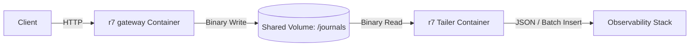

# Journal Tailing and Observability

r7 writes request/response traffic straight to memory-mapped binary files (journals) on disk
instead of serializing logs to text or making network calls on the request thread — that's what
keeps the hot path fast. To get that data into Grafana, ELK, ClickHouse or a WARC archive, you
run a **Tailer**: a separate process/sidecar that reads the journals asynchronously.


```mermaid
graph LR
    Client -->|HTTP| R7[r7 gateway Container]
    R7 -->|Binary Write| Vol[(Shared Volume: /journals)]
    Vol -->|Binary Read| Tailer[r7 Tailer Container]
    Tailer -->|JSON / Batch Insert| Ops[Observability Stack]

```

## 1. Turn on journaling

Tailers only see what the gateway actually writes. Set the level per route (and optionally
override it by response status) in `routes.yaml`:

```yaml
routes:
  - id: my-route
    journal:
      request:
        level: METADATA
      response:
        level: METADATA
        status_overrides:
          5xx: HEADERS   # more detail when things break
```

An override can raise a direction to `HEADERS`, but not to `FULL` unless the base level is already `FULL`: bodies are captured as they stream, and a lower base level installs no capture for an override to switch on. Such a configuration is refused at startup.

`NONE` / `METADATA` / `HEADERS` / `FULL` — see [Configuration §7](config.md#7-journaling-storage)
for the full table and the `storage` block (`work_dir`, `shard_size`, `shard_count`) that
controls where and how those journals are written on disk.

Route ids and upstream target URLs are recorded in every exchange's journal attributes
(`gateway.route.id`, `gateway.target`), and the journal stores ISO-8859-1 text only. A route
id or target URL with a character outside ISO-8859-1 is refused at startup, naming the field.

### Redacted header and query parameter values

At `HEADERS` and `FULL`, a header whose name is not on the `journal_security` whitelist is
journaled with a fingerprint in place of its value. Query parameter values in the request lines
get the same treatment at every level, unless the parameter is on `safe_query_parameters`
(see [Configuration: query parameters](config.md#query-parameters)). There are two forms:

| Form | Example | When |
| --- | --- | --- |
| `id:sha256:` + 6 hex digits | `id:sha256:3f2a91` | default: an unkeyed, truncated SHA-256 of the value |
| `id:hmac:` + 16 hex digits | `id:hmac:9c04e1d27b55a0f3` | `storage.journal_security.fingerprint_key` is set: HMAC-SHA-256 under that key |

Both let you see that two requests carried the same value. Only the keyed form hides the value
from someone who can read the journal. With the unkeyed form, a reader can hash a guess and
compare, so a low-entropy secret such as `Authorization: Basic` with a known user name and a
common password, a short API key or a `role=admin` cookie can be found with a dictionary.
Set a key in production:

```yaml
storage:
  journal_security:
    fingerprint_key: ${R7_FINGERPRINT_KEY}   # at least 32 characters, e.g. `openssl rand -base64 48`
```

Keep the key out of anything a journal reader can see. Changing it changes every fingerprint
from then on, so values journaled before and after the change no longer correlate. The
unkeyed form is still the default so that existing consumers that match on `id:sha256:` keep
working until you opt in. The key applies to journaled header and query parameter values only: the
`gateway.auth.basic.user` attribute and the management endpoint's summaries still use the
unkeyed form.

## 2. Pick a sidecar and mount the shared volume

Gateway and tailer share the `journal_dir` volume: the gateway writes, the tailer only reads.

!!! warning "Mount `journal_dir` read-only on every tailer"
    `R7Tailer` never deletes a segment — it only reads. Deciding when a fully-read segment is
    safe to remove is the reaper's job (`ghcr.io/ethlo/r7-reaper`, see
    [§4 below](#4-retention-the-reaper)); it's the only container that needs write access to
    `journal_dir`. Give each tailer its own `checkpoint_dir` (see the tables below) so running
    JSON and WARC tailers side by side doesn't clash — neither can delete a segment out from
    under the other, and the reaper does not read either checkpoint (it is a plain `ttl`, not
    a "wait for every tailer" policy — see §4 for what that means for you).

---

## 3. Tailer images

### JSON Tailer (Universal)

**Image:** `ghcr.io/ethlo/r7-tailer-json:latest`

This tailer converts the binary journal entries into verbose JSON and streams them to standard output (`stdout`) by default. This is the recommended approach if you use generic log forwarders like **Promtail (for Grafana Loki)**, **Fluent Bit**, or **Vector**.

**Configuration:** like the gateway, this tailer reads a YAML file — `jsonld-tailer.yaml` in
the working directory by default (`/app/config` in the image), overridable via the `JSONLD_TAILER_CONFIG` env var — with the same `${VAR:default}`
interpolation support as `routes.yaml`/`server.yaml`. If the file is missing, all fields fall back
to their defaults below (so a bare container with no config volume still starts and tails
`/journals` to stdout).

| Field           | Default     | Meaning                                                                 |
|------------------|-------------|--------------------------------------------------------------------------|
| `journal_dir`     | `/journals` | Directory the tailer reads binary journals from                          |
| `checkpoint_dir`  | `/checkpoints` | Directory `.r7_checkpoints` is read from and written to; a dedicated volume, outside `journal_dir`, so `journal_dir` can be mounted `:ro` on a secondary tailer. Give each tailer its own to run more than one against the same `journal_dir` |
| `output_path`     | `-`         | Where JSON lines are written; `-` (or `stdout`) means standard output, any other value is a file path (appended to, parent directories created if missing) |
| `output_dir`      | unset       | Write to rotating files in this directory instead of `output_path` (set one or the other). Each file is written as `<file_prefix>-<millis>-<uuid>.jsonl.open` and renamed to `.jsonl` once finished, so a shipper that picks up `*.jsonl` never reads one still being written. A file left `.open` by a crash is sealed on the next start, minus a torn last line, whose record is written again |
| `file_prefix`     | `r7`        | Filename prefix for rotating files                                       |
| `max_file_size`   | `256mb`     | Roll to a new file once the current one reaches this size (at least `64kb`). Supports `b`, `kb`, `mb`, `gb` |
| `max_file_age`    | `15m`       | Roll to a new file once the current one is this old, even with little traffic. Supports `ms`, `s`, `m`, `h`, `d` |
| `poll_interval`   | `1s`        | The longest the tailer waits between reads. It wakes as soon as the gateway commits an entry (the gateway bumps a counter in `shard-<id>.ctl` beside the segments), so on the same host an exchange is read within microseconds to about a millisecond; this interval only matters where that file is not shared, such as across hosts. Supports `ms`, `s`, `m`, `h`, `d` |
| `pretty_print`    | `false`     | Pretty-print the JSON output. Not with `output_dir`: a record over several lines cannot be cut back cleanly after a crash |
| `hide_empty_fields` | `true`    | Omit fields that are `null` or an empty object (unrecorded checksums, absent bodies, headers not journaled, ...) instead of writing them out explicitly. Set to `false` to always emit every field with the same schema on every line, e.g. for consumers that require a fixed columnar schema |

**Record format.** One JSON object per line, one object per leg of the exchange. A proxied
`GET` with headers journaled looks like this (pretty-printed here; empty fields omitted):

```json
{
  "request_id": "01JA0Q6R8X4V2N7M3K5T9B1C0D",
  "start": "2026-10-01T12:00:00.000120Z",
  "end": "2026-10-01T12:00:00.004410Z",
  "duration": 0.004290,
  "remote_address": "10.0.0.7",
  "remote_address_source": "SOCKET",
  "client_request": {
    "level": "HEADERS", "method": "GET", "path": "/items", "query": "page=id:sha256:d4735e", "protocol": "HTTP/1.1",
    "headers": {"host": "api.example.com"}, "header_bytes": 142, "body_bytes": 0
  },
  "upstream_request": {
    "level": "HEADERS", "method": "GET", "path": "/v1/items", "query": "page=id:sha256:d4735e", "protocol": "HTTP/1.1",
    "headers": {"host": "backend:8080"}, "start": "2026-10-01T12:00:00.000300Z"
  },
  "upstream_response": {
    "level": "HEADERS", "protocol": "HTTP/1.1", "status": 200, "reason": "OK",
    "headers": {"content-type": "application/json"},
    "first_byte": "2026-10-01T12:00:00.004100Z", "end": "2026-10-01T12:00:00.004380Z", "duration": 0.004080
  },
  "client_response": {
    "level": "HEADERS", "protocol": "HTTP/1.1", "status": 200, "reason": "OK",
    "headers": {"content-type": "application/json"}, "header_bytes": 98, "body_bytes": 1274
  }
}
```

The `upstream_*` objects are present only when the request was proxied. At `FULL`, a leg with a
body adds `body` (base64) and `checksum` (the CRC32C the gateway recorded); `observed_checksum`
appears beside it only when the body read back does not match. A record that is not a complete
exchange carries `incomplete` with the reason; without an end event (`TIMED_OUT`, `SHUTDOWN`,
`CAPACITY_EVICTED`) timing, status and sizes are unknown and left out. Attributes the gateway
recorded are under `attributes`. A header with one value is a string, one sent more than once
an array of its values.

**Example `config/jsonld-tailer.yaml`:**

```yaml
journal_dir: /journals
checkpoint_dir: /checkpoints
output_path: "-"
```

**Example Docker Compose Integration:**

```yaml
services:
  r7-api:
    image: ghcr.io/ethlo/r7-gateway:latest
    volumes:
      - ./config:/app/config:ro
      - r7-journals:/journals:rw # Mount the shared volume

  r7-tailer-json:
    image: ghcr.io/ethlo/r7-tailer-json:latest
    volumes:
      - ./config/jsonld-tailer.yaml:/app/config/jsonld-tailer.yaml:ro
      - r7-journals:/journals:ro # this tailer only ever reads; retention is a separate reaper's job
      - r7-json-checkpoints:/checkpoints:rw # .r7_checkpoints lives here by default
    # The output of this container goes to Docker's stdout, 
    # ready to be scraped by your infrastructure's logging driver.

volumes:
  r7-journals:
  r7-json-checkpoints:

```

### WARC/zstd Tailer (Archival)

**Image:** `ghcr.io/ethlo/r7-tailer-warc:latest`

This tailer writes completed exchanges as [WARC 1.1](https://iipc.github.io/warc-specifications/specifications/warc-format/warc-1.1/) records — the standard web-archiving format used by the Internet Archive and national libraries — to rotating `.warc.zst` files (one independent Zstandard frame per record, so `zstd -d` alone decompresses a file back to plain WARC). Use this when you need a durable, replayable, tool-interoperable record of actual traffic (compliance archiving, incident forensics, replaying traffic against a new backend), rather than a queryable log stream — feed the output to [pywb](https://github.com/webrecorder/pywb) or any WARC-aware tool.

Each exchange becomes up to four linked records (client request, upstream request, upstream response, client response); duplicate payloads across exchanges are deduplicated as WARC `revisit` records; and a checksum mismatch on read is marked rather than silently archived. See [`design/warc.md`](https://github.com/ethlo/r7/blob/main/design/warc.md) for the full record-shape and dedup rationale.

**Configuration:** same YAML config mechanism as the JSON tailer above — `warc-tailer.yaml`
by default, overridable via the `WARC_TAILER_CONFIG` env var.

| Field                      | Default     | Meaning                                                                    |
|----------------------------|-------------|-----------------------------------------------------------------------------|
| `journal_dir`               | `/journals` | Directory the tailer reads binary journals from                             |
| `checkpoint_dir`            | `/checkpoints` | Directory `.r7_checkpoints` is read from and written to; a dedicated volume, outside both `journal_dir` (mounted `:ro`) and `output_dir` (a reaper reads this directory and has no business in the archive). Give each tailer its own to run more than one against the same `journal_dir` |
| `output_dir`                | `/warc`     | Directory rotated `.warc.zst` files are written to. A file is written as `.warc.zst.open` and renamed once finished; one left `.open` by a crash is cut back to its last complete record and sealed on the next start |
| `file_prefix`               | `r7`        | Filename prefix for rotated WARC files                                      |
| `max_file_size`             | `1gb`       | Rotate to a new file once the current one reaches this size (at least `64kb`; a size that couldn't hold a single record is refused at startup). Supports `b`, `kb`, `mb`, `gb` |
| `max_file_age`              | `15m`       | Rotate to a new file once the current one is this old, even under light/no traffic (size-or-age rollover). Supports `ms`, `s`, `m`, `h`, `d` |
| `zstd_level`                | `9`         | Zstandard compression level (1-22), applied per WARC record                 |
| `dedup_cache_entries`       | `100000`    | Max number of payload digests remembered for cross-exchange revisit dedup   |
| `poll_interval`             | `1s`        | The longest the tailer waits between reads; it wakes as soon as the gateway commits, as for the JSON tailer. Supports `ms`, `s`, `m`, `h`, `d` |

**Example `config/warc-tailer.yaml`:**

```yaml
journal_dir: /journals
output_dir: /warc
```

**Example Docker Compose Integration:**

```yaml
services:
  r7-api:
    image: ghcr.io/ethlo/r7-gateway:latest
    volumes:
      - r7-journals:/journals:rw

  r7-tailer-warc:
    image: ghcr.io/ethlo/r7-tailer-warc:latest
    volumes:
      - ./config/warc-tailer.yaml:/app/config/warc-tailer.yaml:ro
      - r7-journals:/journals:ro # this tailer only ever reads; retention is a separate reaper's job
      - r7-warc:/warc:rw
      - r7-warc-checkpoints:/checkpoints:rw

volumes:
  r7-journals:
  r7-warc:
  r7-warc-checkpoints:

```

## 4. Retention: The Reaper

**Image:** `ghcr.io/ethlo/r7-reaper:latest`

Every tailer above is read-only by design (see §2's warning) — something else has to delete a
sealed segment once it is no longer needed, or `journal_dir` grows without bound. That something
is the reaper: a small standalone process whose only job is deleting old segments from a shared
journal volume.

!!! warning "`ttl` deletes whether or not a segment was read"
    With `tailers` listed, a segment is deleted early once every one of them is done with it
    (see the table below). Whatever the tailers say, a sealed (`.r7f`) segment is deleted once
    it has existed for longer than `ttl`, read or not: that is the bound on disk use. Set `ttl` comfortably
    longer than the slowest tailer's realistic lag — including time to recover from a restart —
    or a slow or temporarily-down tailer will lose data it never got a chance to read. A
    segment the gateway's recovery quarantined (`*.corrupt`, see
    `design/journal-invariants.md`) is reaped under the same `ttl`, since nothing will ever read
    it. A segment a *tailer* cannot read keeps its name: the tailer records that in its own
    checkpoint file and logs it, because the journal directory is read-only to it, and the
    file is reaped like any other sealed segment. Active (`.flux`) segments are never reaped, at any age — they belong exclusively to the
    gateway process that may still be writing to them.

    Age is read from the timestamp embedded in the segment's own filename, never from the
    file's filesystem last-modified time: mtime is reset by a backup restore, an `rsync` run
    without `-a`, or a volume migration, any of which would otherwise silently defeat `ttl`. A
    segment whose name the reaper cannot parse is left alone rather than guessed at from
    mtime — it is simply never a deletion candidate.

**Configuration:** same YAML config mechanism as the tailers — `reaper.yaml` by default,
overridable via the `REAPER_CONFIG` env var.

| Field           | Default     | Meaning                                                                 |
|------------------|-------------|--------------------------------------------------------------------------|
| `journal_dir`     | `/journals` | Directory the reaper scans (and deletes from) — mount this read-write, unlike every tailer |
| `ttl`             | `7d`        | How long a sealed segment is kept, counted from the last-event timestamp embedded in its filename (not the file's filesystem mtime — see below), before it is deleted. Supports `ms`, `s`, `m`, `h`, `d` |
| `tailers`         | none        | Checkpoint directories of the tailers that must all be done with a segment before it is deleted ahead of `ttl` (mount them read-only). A segment is done for a tailer when its checkpoint file says it was read to the end and everything in it delivered, and the tailer does not need it to rebuild an exchange still open. A listed tailer with no readable checkpoint file stops early deletion, so a tailer that is down keeps everything for up to `ttl` |
| `min_age`         | `1h`        | How old a segment must be before it is deleted ahead of `ttl`. A tailer counts a segment as done once its output reached the OS, not the disk; keep this above the tailers' `max_file_age` (15 minutes by default), after which their output files are fsync'd, so a power loss cannot take both copies |
| `poll_interval`   | `1m`        | Delay between sweeps. Supports `ms`, `s`, `m`, `h`, `d`                  |

**Example `config/reaper.yaml`:**

```yaml
journal_dir: /journals
ttl: 7d
# Delete as soon as both tailers are done with a segment (and it is an hour old), not after 7 days
tailers:
  - /checkpoints/json
  - /checkpoints/warc
```

**Who may write what.** Each component writes only what it owns and reads the rest, and the
mounts enforce it:

| | `r7-journals` | a tailer's checkpoints | a tailer's output |
| --- | --- | --- | --- |
| gateway | writes (segments, `.seq`, `.ctl`) | — | — |
| tailer | reads | writes its own | writes its own |
| reaper | deletes sealed and quarantined segments | reads | — |

So the reaper can delete what the gateway wrote, a tailer cannot, and the reaper cannot touch
anything a tailer wrote. The one thing that crosses a boundary, the reaper trusting a tailer's
checkpoint file, can only keep a segment longer: anything short of "done" leaves it for `ttl`.

**Example Docker Compose Integration:**

```yaml
services:
  r7-api:
    image: ghcr.io/ethlo/r7-gateway:latest
    volumes:
      - r7-journals:/journals:rw

  r7-tailer-json:
    image: ghcr.io/ethlo/r7-tailer-json:latest
    volumes:
      - r7-journals:/journals:ro             # reads only; retention is the reaper's job
      - r7-json-checkpoints:/checkpoints:rw  # its own progress

  r7-tailer-warc:
    image: ghcr.io/ethlo/r7-tailer-warc:latest
    volumes:
      - r7-journals:/journals:ro
      - r7-warc:/warc:rw
      - r7-warc-checkpoints:/checkpoints:rw

  r7-reaper:
    image: ghcr.io/ethlo/r7-reaper:latest
    volumes:
      - ./config/reaper.yaml:/app/config/reaper.yaml:ro
      - r7-journals:/journals:rw                     # the only container that deletes from it
      - r7-json-checkpoints:/checkpoints/json:ro    # read to learn what each tailer is done with;
      - r7-warc-checkpoints:/checkpoints/warc:ro    # never the tailers' output

volumes:
  r7-journals:
  r7-json-checkpoints:
  r7-warc:
  r7-warc-checkpoints:

```

## 5. Visualizing your data

Once your data is routed through a tailer:

* **If using the JSON Tailer with Promtail/Loki:** You can use Grafana's LogQL to filter and aggregate your gateway traffic, extracting metrics dynamically from the JSON fields (like `duration`, `client_response.status` — `client_response_status` after LogQL's `json` parser — or specific headers).
* **If using the WARC Tailer:** WARC files are for archival/replay, not dashboards — feed them to a WARC-aware tool (e.g. [pywb](https://github.com/webrecorder/pywb)) to replay captured traffic, or to an indexer for forensic search.
* **Into ClickHouse:** r7 ships no ClickHouse tailer. Point the JSON Tailer's `output_path` at a file and batch-insert its lines with a loader of your own (they are one JSON object per line, which ClickHouse reads as `JSONEachRow`), then query them from Grafana with the ClickHouse plugin.