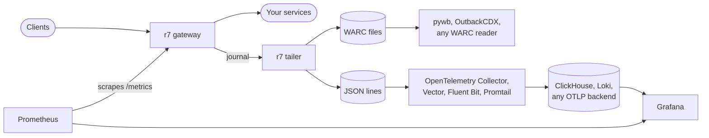

# Where r7 fits

r7 adds a record of every exchange to your stack and replaces nothing in it. It does three
things, routing traffic, recording every exchange and reporting its own health, and each comes
out in a standard format that tools you already run read: WARC, JSON lines and Prometheus.



| What | Format | Specified in | For |
| --- | --- | --- | --- |
| Every exchange, as evidence | WARC 1.1, one Zstandard frame per record | [The WARC profile](warc.md) | Archiving, forensics, replay |
| Every exchange, as a log line | JSON Lines | [The JSON line](journaling.md#the-json-line) | Search, dashboards, alerting |
| The gateway's own health | Prometheus text, `/health` | [Metrics](config.md#metrics) | Monitoring, liveness probes |

The JSON line and the WARC records share the request id. When a WARC file holds an exchange, its
JSON line points at the records by file, offset and length, so a query result in any of the tools
below leads straight to the archived exchange. Which exchanges a WARC file holds is set by
[`warc.exchanges`](journaling.md#3-the-tailer).

The snippets on this page are the smallest configuration that connects r7 to each tool. Each one
names the version it was written against; the tool's own documentation covers the rest.

## Logs: the JSON lines

The tailer writes one JSON object per exchange, to standard output or to rotating files
(`json.output: file`). Files are written as `.jsonl.open` and renamed to `.jsonl` when finished,
so a shipper that reads `*.jsonl` never sees a file still being written.

Two settings matter in every shipper. It must keep its read position on persistent storage, or a
restart reads the retained files again and loads every exchange twice. And its line-size limit
must hold a whole exchange: with `json.bodies: true`, the request and the response body can both
be in one line, base64-encoded, so set the limit from the largest pair of bodies together plus a
third, plus the headers. Shippers split or drop a
longer line, and a split line is no longer JSON.

### OpenTelemetry Collector

The Collector's [`filelog`](https://github.com/open-telemetry/opentelemetry-collector-contrib/tree/main/receiver/filelogreceiver)
receiver reads the files and sends the exchanges on as OTLP logs, to any backend that accepts
them. Written against `otelcol-contrib` 0.162:

<!-- docs-check: skip -->
```yaml
extensions:
  file_storage:
    directory: /var/lib/otelcol/storage   # a persistent volume
    create_directory: true

receivers:
  filelog:
    include: [/json/*.jsonl]
    start_at: beginning
    storage: file_storage
    max_log_size: 16MiB
    operators:
      - type: json_parser
        timestamp:
          parse_from: attributes.start
          layout_type: gotime
          layout: "2006-01-02T15:04:05.999999Z07:00"

exporters:
  otlphttp:
    endpoint: http://your-backend:4318

service:
  extensions: [file_storage]
  pipelines:
    logs:
      receivers: [filelog]
      exporters: [otlphttp]
```

### Vector into ClickHouse

[Vector](https://vector.dev/docs/) reads the files and inserts the exchanges into ClickHouse in
batches. Vector keeps its read positions in its `data_dir`, which must be persistent. Written
against Vector 0.59:

<!-- docs-check: skip -->
```yaml
sources:
  r7:
    type: file
    include: [/json/*.jsonl]
    read_from: beginning
    max_line_bytes: 16777216

transforms:
  r7_exchanges:
    type: remap
    inputs: [r7]
    source: . = parse_json!(string!(.message))

sinks:
  clickhouse:
    type: clickhouse
    inputs: [r7_exchanges]
    endpoint: http://clickhouse:8123
    database: default
    table: r7_exchanges
    skip_unknown_fields: true
    date_time_best_effort: true
```

A table for it, written against ClickHouse 25.8. Each of the four legs lands in a `JSON` column,
so a field such as `client_response.status` is queried by its path. An exchange the tailer gave up
on carries `incomplete` and has no `start`, `duration` or `route_id`, so those columns stay empty
for it rather than reading as a real zero:

```sql
CREATE TABLE r7_exchanges
(
    request_id        String,
    incomplete        LowCardinality(Nullable(String)),
    route_id          LowCardinality(String),
    start             Nullable(DateTime64(6, 'UTC')),
    duration          Nullable(Float64),
    remote_address    String,
    client_request    JSON,
    upstream_request  JSON,
    upstream_response JSON,
    client_response   JSON,
    warc              JSON
)
ENGINE = MergeTree
ORDER BY (route_id, ifNull(start, toDateTime64(0, 6, 'UTC')));
```

ClickHouse is a queryable copy here, not the archive: the WARC files are. Keep the sealed `.jsonl`
files for as long as you may want to load a table again, since some fields of a row, such as
`route_id` and `duration`, are only in the JSON line.

### Loki and other shippers

Promtail, Fluent Bit and Docker's logging drivers read the tailer's standard output or the
`.jsonl` files like any other JSON log. In Grafana, LogQL's `json` parser turns the fields into
labels, so `client_response.status` becomes `client_response_status`.

## The archive: the WARC files

The WARC files are for keeping and replaying exchanges, not for dashboards; [the WARC
profile](warc.md) describes what is in them. With `cdxj_index: true`, each file gets a CDXJ index,
the format [pywb](https://pywb.readthedocs.io/) and [OutbackCDX](https://github.com/nla/outbackcdx)
read, so an exchange is found by URL and time without scanning the archive. Its offsets and lengths
point into the `.warc.zst` file as written, one Zstandard frame per record: a reader loading
records through the index needs to read Zstandard-compressed WARC, and a file decompressed with
`zstd -d` needs an index of its own.

## Monitoring: Prometheus

The management port serves the gateway's own health: responses per route and status code,
latency histograms (for routes with the `SimpleMetrics` filter), connections, journal space and
component status. Traffic detail stays in the journal. Written against Prometheus 3.x:

<!-- docs-check: skip -->
```yaml
scrape_configs:
  - job_name: r7
    static_configs:
      - targets: ["r7:18888"]
```

The management port answers only a `Host` it knows, so a scrape by a DNS name such as `r7`
needs that name in `allowed_hosts`. The container images listen on every interface; a gateway
run from the jar listens on `127.0.0.1` until `management.host` (or `R7_MANAGEMENT_HOST`) names
an address Prometheus can reach:

```yaml title="server.yaml"
management:
  allowed_hosts: [r7]
```

Point a Kubernetes liveness probe at `/health` on the same port. It turns `503` only when the
gateway's own housekeeping has stopped, never for an upstream that is down.
